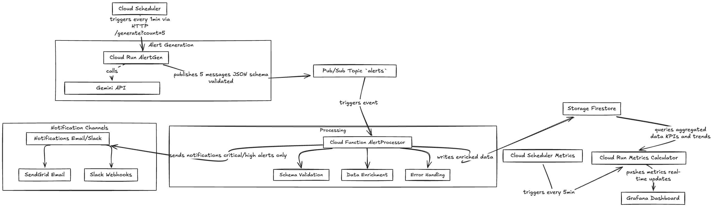

WIP

Event-driven system that mocks alerts with an LLM and attemps to monitor and observe them.

# Infra services

##  Google Cloud Scheduler
Triggers alert generation every minute and metrics calculation every 5 minutes.

##  Google Cloud Run (AlertGen)
Generates 5 alerts using Gemini API with JSON schema validation and publishes the data to pub/sub.

##  Google Pub/Sub
Handles communication between alerts and different services.

##  Google Cloud Functions
Processes incoming alerts with validation, enrichment, and storage.

##  Google Firestore
KV Store for storing processed and enriched alert data.

##  SendGrid
Sends email alerts for critical and high severity issues.

##  Google Cloud Run (Metrics)
Calculates system metrics from stored alert data.

##  Grafana
Dashboard for monitoring.

##  Google Gemini API
Generation the actual alerts according to the schema in the prompt.
